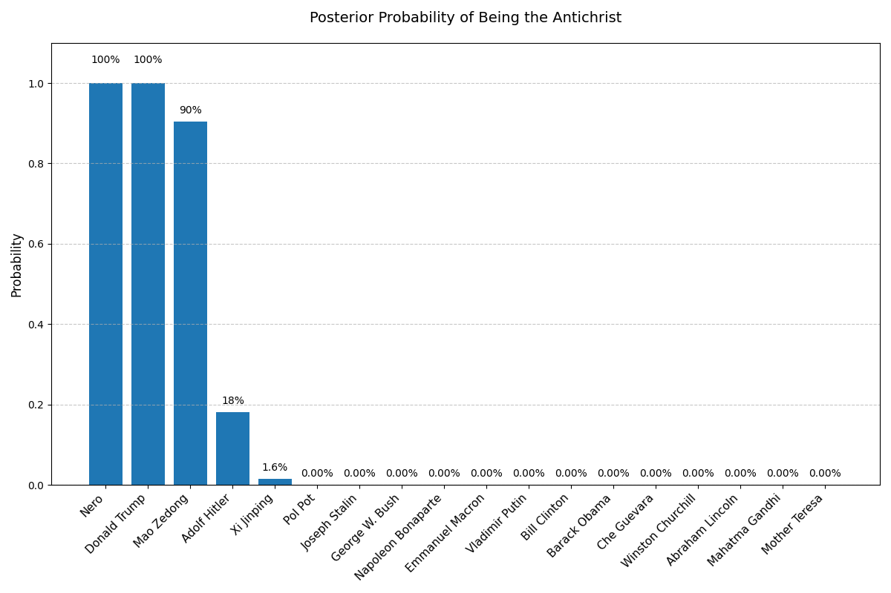
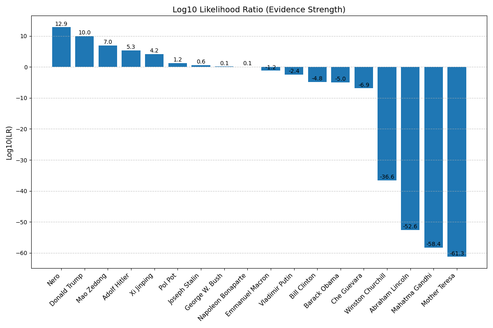
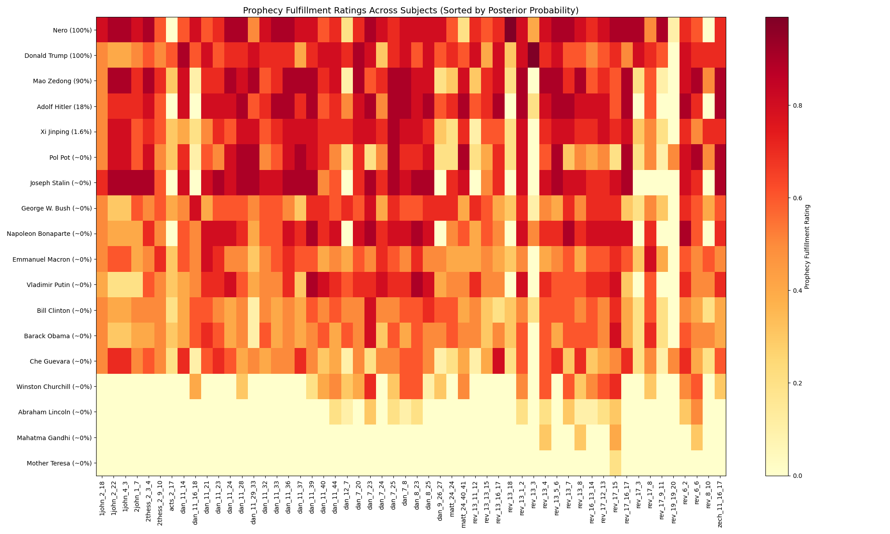

# Antichrist Bayesian Analysis

A comprehensive Bayesian analysis framework to evaluate how well different historical figures match biblical prophecies about the Antichrist.

Based on the article: [Could American Evangelicals Spot the Antichrist? Here Are the Biblical Predictions](https://www.benjaminlcorey.com/could-american-evangelicals-spot-the-antichrist-heres-the-biblical-predictions/)

## Overview

This project applies Bayesian probability analysis to assess various historical figures against biblical prophecies about the Antichrist. Rather than cherry-picking evidence for a specific individual, this tool systematically evaluates multiple candidates across all relevant biblical prophecies.

The analysis follows these principles:

1. **Comprehensive prophecy evaluation**: Includes all relevant prophecies from Revelation, Daniel, and other biblical books
2. **Multi-candidate comparison**: Evaluates multiple historical figures using the same criteria
3. **Evidence-based ratings**: Uses a 0.0-1.0 scale to rate how well each figure matches each prophecy
4. **Bayesian probability**: Calculates likelihood ratios and posterior probabilities using Bayes' theorem
5. **Visualization**: Generates comparative plots and heatmaps to visualize results

## Directory Structure

```
antichrist/
├── antichrist_analysis.py     # Main analysis script
├── antichrist_predictions.md  # Documentation of prophecies
├── antichrist_probability.png # Visualization of posterior probabilities
├── antichrist_likelihood.png  # Visualization of likelihood ratios
├── prophecy_heatmap.png       # Heatmap of prophecy fulfillment across subjects
├── README.md                  # This documentation file
├── data/
│   ├── prophecies/            # YAML files containing biblical prophecies
│   │   ├── daniel.yaml        # Prophecies from Book of Daniel
│   │   ├── revelation.yaml    # Prophecies from Book of Revelation
│   │   └── other_prophecies.yaml  # Prophecies from other biblical books
│   └── subjects/              # YAML files for historical figures being analyzed
                               # (Contains various world leaders, dictators,
                               #  and control subjects like religious figures)
```

## Usage

Run the analysis script with default settings:

```bash
python antichrist_analysis.py
```

Specify a custom prior probability:

```bash
python antichrist_analysis.py --prior 0.000001
```

Analyze specific subjects:

```bash
python antichrist_analysis.py --subjects "Donald Trump" "Adolf Hitler" "Nero"
```

Generate comparison plots (recommended):

```bash
python antichrist_analysis.py --plot
```

The analysis includes a diverse range of subjects:

- **Modern Political Leaders**: Trump, Obama, G.W. Bush, Clinton, Putin, Macron, Xi Jinping
- **Historical Dictators/Rulers**: Hitler, Stalin, Mao Zedong, Pol Pot, Napoleon, Nero
- **Revolutionaries**: Che Guevara
- **Democratic Leaders**: Churchill, Lincoln
- **Moral/Religious Figures**: Mother Teresa, Gandhi (as control subjects)

This comprehensive selection allows comparison between figures commonly associated with authoritarian traits and control subjects who should not match the antichrist prophecies.

## Adding New Subjects

To add a new historical figure for analysis:

1. Create a new YAML file in the `data/subjects/` directory
2. Follow the format in existing subject files, providing:
   - Basic information (name, title, time period)
   - Prophecy ratings for each prophecy ID
   - Evidence examples for key prophecies

Example:

```yaml
name: "New Figure"
title: "Historical Title"
time_period: "YYYY-YYYY"

prophecy_ratings:
  rev_13_3: 0.7  # Rating with comment
  # Additional prophecy ratings...

evidence:
  rev_13_3: "Specific evidence for this prophecy fulfillment"
  # Additional evidence examples...
```

## Methodology

The analysis uses Bayes' theorem to update the probability that a given figure is the Antichrist based on how well they match each prophecy:

1. Start with a skeptical prior probability (default: one in a million)
2. For each prophecy:
   - Use prophecy-specific Bayesian values (how likely the Antichrist vs a normal person would fulfill it)
   - Scale these values by the subject's fulfillment rating (0.0-1.0)
   - Calculate the likelihood ratio (LR) = P(Evidence|Antichrist) / P(Evidence|Not Antichrist)
   - Zero ratings (prophecies definitely not fulfilled) are treated as evidence against the hypothesis
3. Compute the combined likelihood ratio by multiplying all individual LRs (using logarithms to avoid numerical issues)
4. Calculate posterior odds = prior odds × overall likelihood ratio
5. Convert to probability: P = odds / (1 + odds)

Critical prophecies with large differences between P(E|H) and P(E|¬H) have much greater impact on the final probability. For example, the prophecy about surviving a fatal head wound has a much larger effect than more common prophecies.

## Visualization

The analysis generates three visualization outputs:

### 1. Posterior Probability Comparison

A bar chart showing the posterior probability that each subject is the Antichrist:



### 2. Log Likelihood Ratio Comparison

A bar chart showing the log likelihood ratios (strength of evidence) for each subject:



### 3. Prophecy Fulfillment Heatmap

A detailed heatmap showing how well each subject fulfills each prophecy, with subjects sorted by posterior probability:



## Disclaimer

This project is for educational and exploratory purposes only. It applies Bayesian analysis to biblical interpretation but makes no theological claims. The prophecy fulfillment ratings are subjective assessments based on historical information and should be considered as such.

## Requirements

- Python 3.6+
- PyYAML
- matplotlib
- numpy